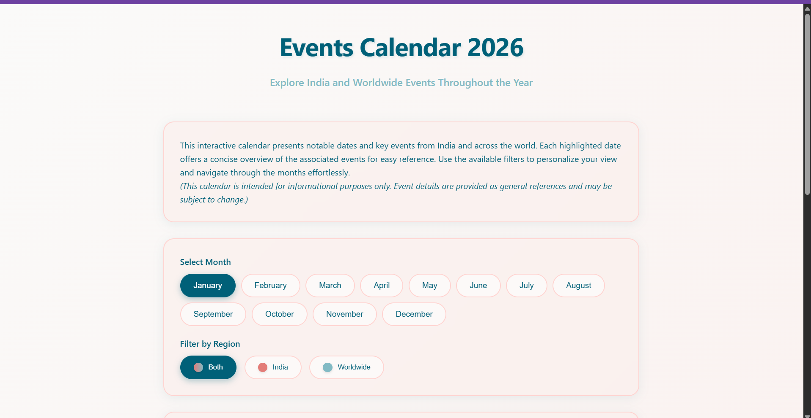
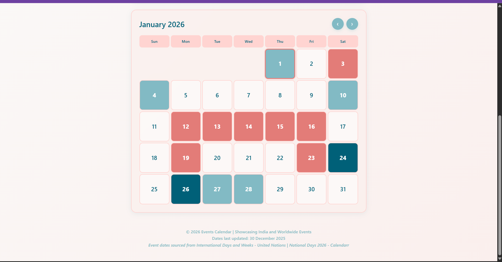
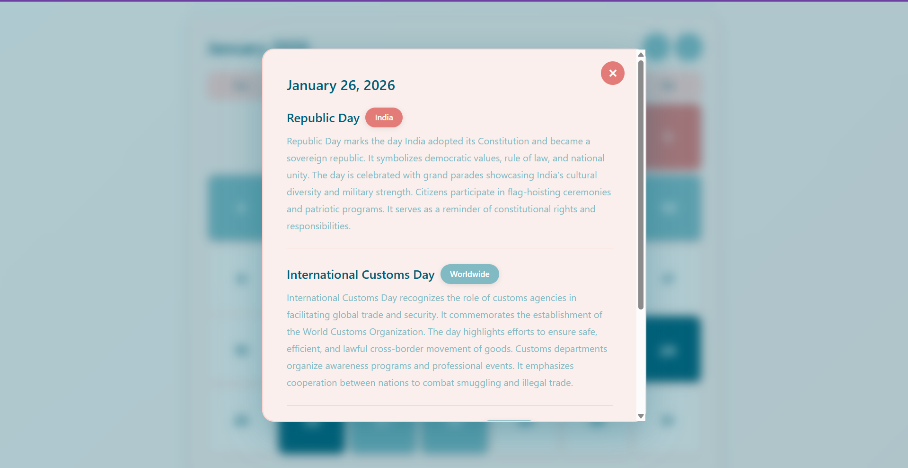

# 2026 Interactive Calendar

An interactive 2026 calendar web project built with HTML, CSS, and JavaScript. It displays all dates of the year, supports navigation via arrows, and dynamically shows holidays/events from a JSON file.

## Features

* Full 2026 calendar display
* Large, readable date numbers
* Arrow navigation for months
* Optional swipe support for mobile
* Dynamic events loaded from `holidays_2026.json`

## Demo

Check it live here: [Event Calendar 2026](https://Tharun-XD.github.io/Calendar_2026/)

## Project Structure

```
calendar_2026/
├─ index.html       # Main calendar page
├─ style.css        # CSS styling
├─ script.js        # JavaScript for navigation and interaction
├─ holidays_2026.json    # Holiday/event data
└─ README.md        # This file
```

## Screenshots

### Page Desciption and Month Navigation View


### Calendar View


### Event Description View



## Data Collection

* The `holidays_2026.json` file contains events/holidays for the year 2026.
* Each event includes the following fields: `date`, `title`, and optional `description`.
* Data was last collected/updated on **December 30, 2025**.
* Events were curated manually for demonstration purposes and are loaded dynamically by the calendar.

## Usage

1. Clone the repository:

   ```bash
   git clone https://github.com/Tharun-XD/Calendar_2026.git
   ```
2. Open `index.html` in a browser to view the calendar.
3. To add or modify holidays/events, edit `holidays_2026.json` and reload the page.

## Technologies Used

* HTML
* CSS
* JavaScript
* JSON (for holidays/events)

## Notes

* Works on modern browsers.
* Fully responsive on mobile devices with optional swipe support.

## License


## Data Collection

* The `holidays_2026.json` file contains events/holidays for the year 2026.
* Each event includes the following fields: `date`, `title`, and optional `description`.
* Data was last collected/updated on **December 30, 2025**.
* Events were curated manually for demonstration purposes and are loaded dynamically by the calendar.

## Usage

1. Clone the repository:

   ```bash
   git clone https://github.com/Tharun-XD/Calendar_2026.git
   ```
2. Open `index.html` in a browser to view the calendar.
3. To add or modify holidays/events, edit `holidays_2026.json` and reload the page.

## Technologies Used

* HTML
* CSS
* JavaScript
* JSON (for holidays/events)

## Notes

* Works on modern browsers.
* Fully responsive on mobile devices with optional swipe support.

## License

This project is open for personal and educational use.
